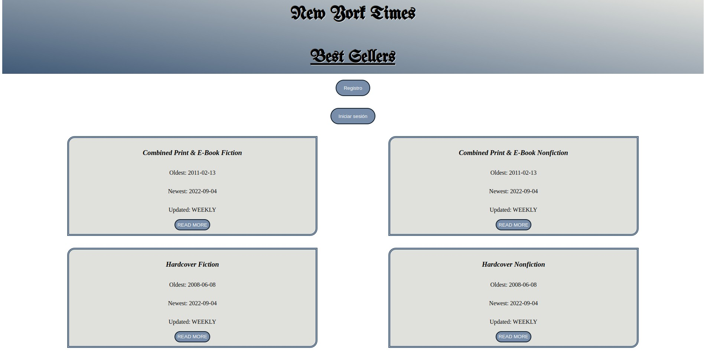
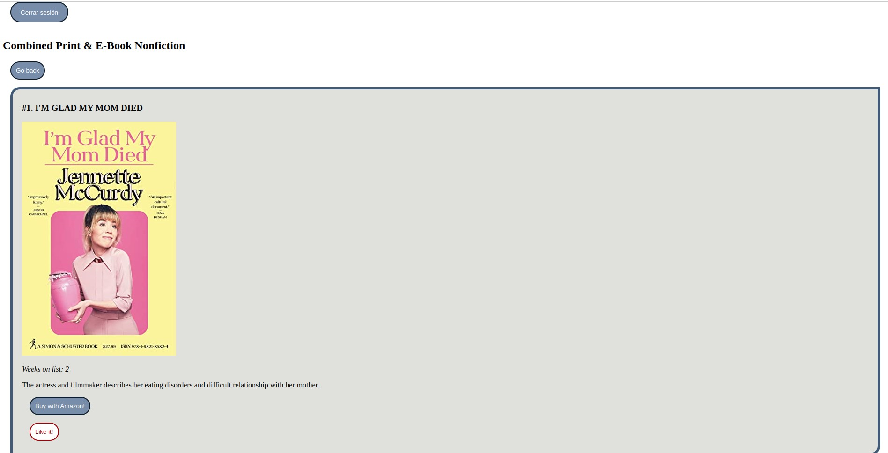

# biblioteca-front

En este proyecto aplicaremos los conocimientos de Front adquiridos.

Se trata de una biblioteca online, donde obtenemos acceso a diferentes categorías literarias.

En la pantalla principal, podemos visualidar una sección pare registrarse o iniciar sesión, así como las categorías generales; cada una de ellas recogida en una tarjeta.

Una vez el usuario inicie sesión, aparecerá su mail de registro en pantalla para que pueda verificar su acceso.

Al hacer click en el botón "read more", accederá a cada libro dentro de dicha categoría, con la información de cada uno de ellos en la misma tarjeta. 

Además, al estar el usuario registrado, podrá comprar el libro en Amazon o añadirlo a sus favoritos haciendo click a los botones presentes en cada una de las entradas.

Por último, el usuario, desde esta misma página, puede cerrar sesión o volver a la página inicial.